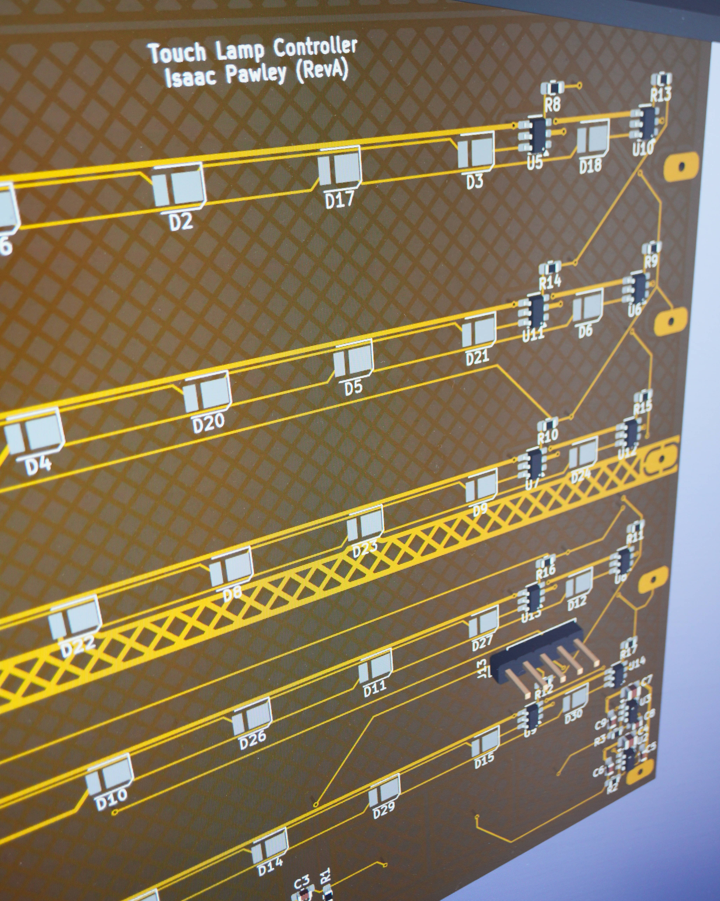
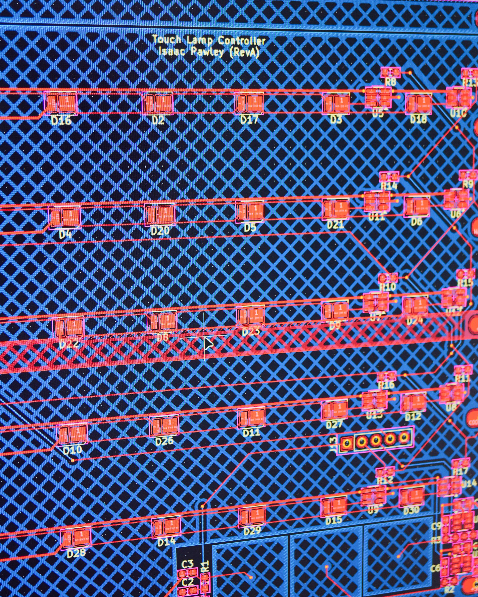

# Flexi Lamp
A touch-sensing lamp lamp made of flexible PCBs.

# Table of Contents
- [Features](#features)
- [Fixes and Updates](#fixes-and-updates)
- [Pictures](#pictures)
- [Copyright and Licensing](#copyright-and-licensing)
- [Contact](#contact)

# Features
- Warm and cool white dimmable LEDs
- Capacitive touch sensing buttons for control

# Fixes and Updates
> [!IMPORTANT]
> This project is currently under development. Please bear with me while I work on improving functionality.

# Pictures
<table align="center">
  <tr>
    <td align="center">
       
      <b>Revision A PCB layout</b>
    </td>
    <td align="center">
       
      <b>Gound plane cross hatching</b>
    </td>
  </tr>
</table>

# Copyright and Licensing
See [license](LICENSE) for in-depth info.

Contact me if anything here is incorrect.

# Contact
If you'd like to get in touch, feel free to reach out!

  
  
  
  

